# JavaDesignPatterns

https://capgemini.udemy.com/course/design-patterns-in-java-concepts-hands-on-projects/learn/lecture/9584434#overview


### Adapter Pattern
Adapter example

This is the client code:
```java
public class Main {

	public static void main(String[] args) {
		/** Using Class/Two-way adapter **/ 
		EmployeeClassAdapter adapter  = new EmployeeClassAdapter();
		populateEmployeeData(adapter);
		BusinessCardDesigner designer = new BusinessCardDesigner();
		String card  = designer.designCard(adapter);
		System.out.println(card);
		
		System.out.println("************************************************************");
		/** Using Object Adapter **/
		Employee employee = new Employee();
		populateEmployeeData(employee);
		EmployeeObjectAdapter objectAdapter = new EmployeeObjectAdapter(employee); 
		card = designer.designCard(objectAdapter);
		System.out.println(card);
	}

	private static void populateEmployeeData(Employee employee) {
		employee.setFullName("Elliot Alderson");
		employee.setJobTitle("Security Engineer");
		employee.setOfficeLocation("Allsafe Cybersecurity, New York City, New York");
	}
}
```

### Bridge Design Pattern
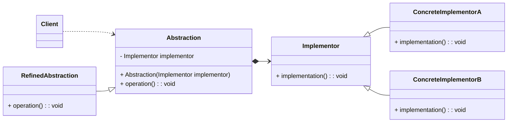
#### Java Examples
- Collections.newSetFromMap()
- java.sql.Driver

## Decorator Design Pattern
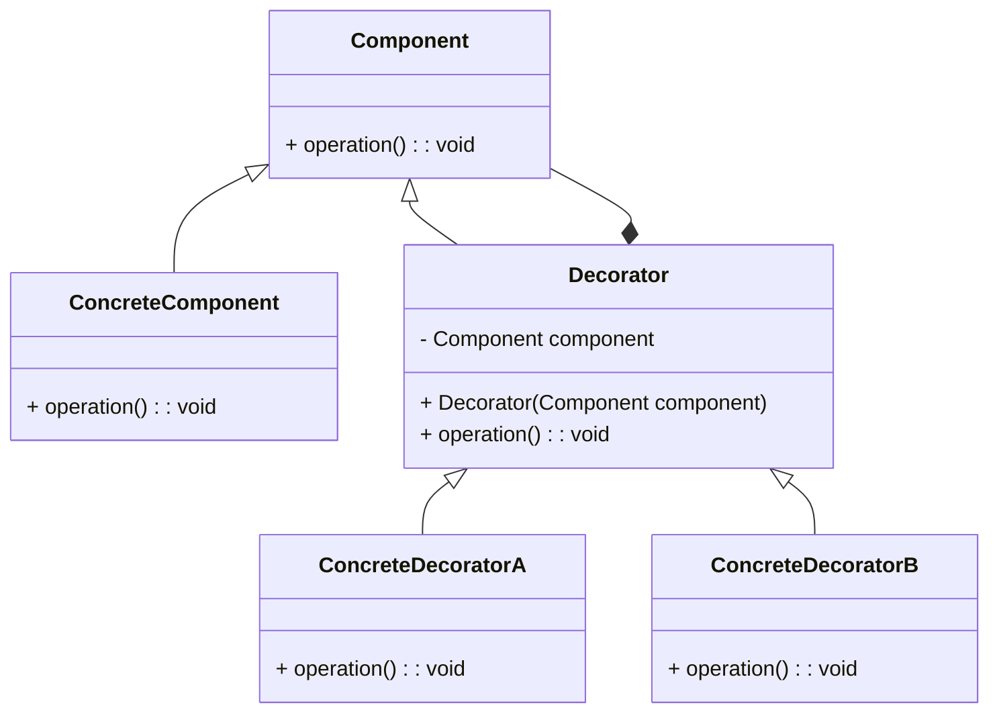

Implementation
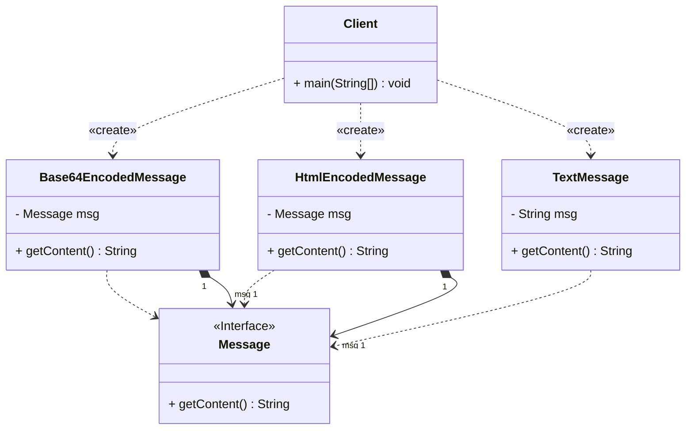

### Another Decorator pattern example
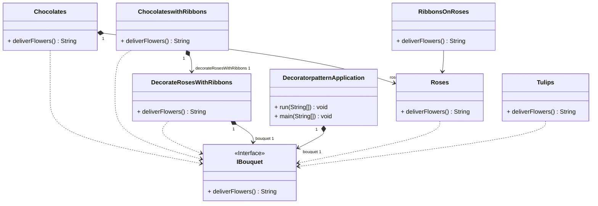

Java examples
- java.io.OutputStream

```java
import java.io.BufferedOutputStream;
import java.io.FileOutputStream;

class Example {
    public static void main(String[] args) {
        try(OutputStream os = new BufferedOutputStream(new FileOutputStream("xfiles_mulder_notes.txt"))) {
            os.write('x');
            os.flush();

        }
    }    
}

```

### Composite Design Pattern
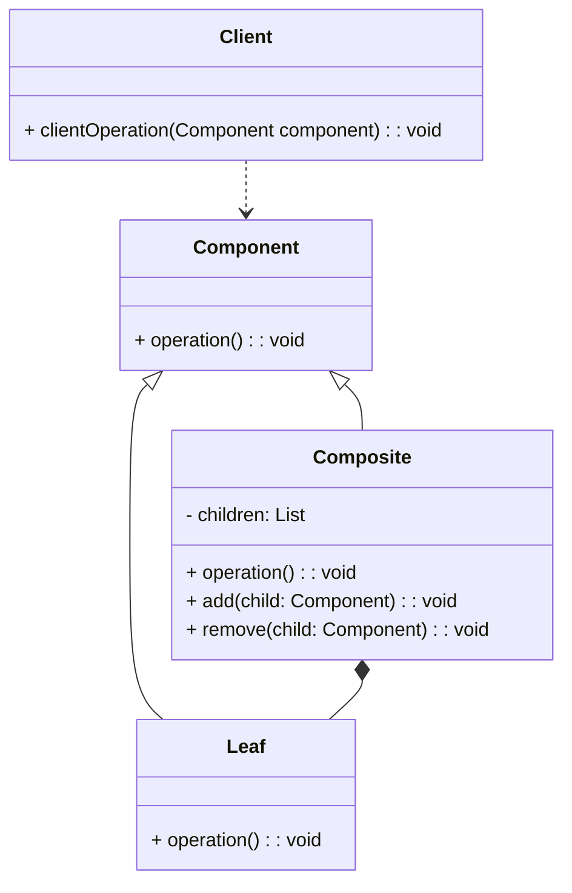
Example code
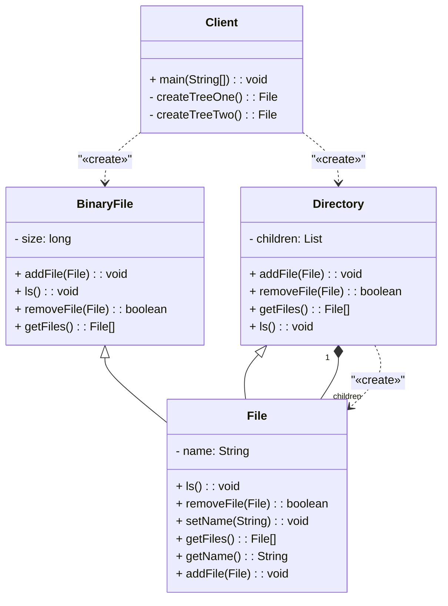

### Facade Pattern

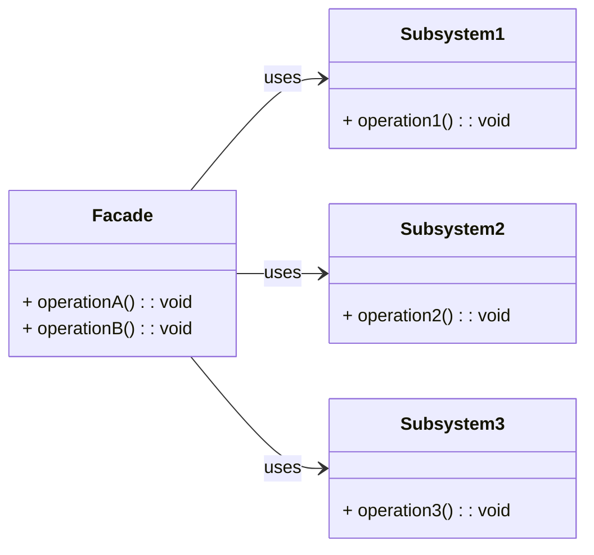
Example:
- java.net.URL
  - openStream()

### Proxy Design Pattern
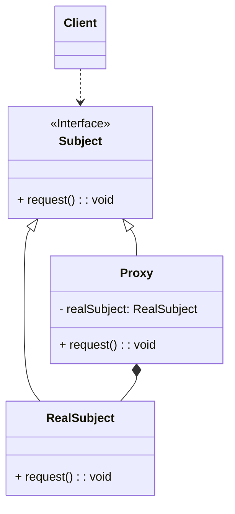

## Behavioral Design Patterns

### Chain of Responsibility
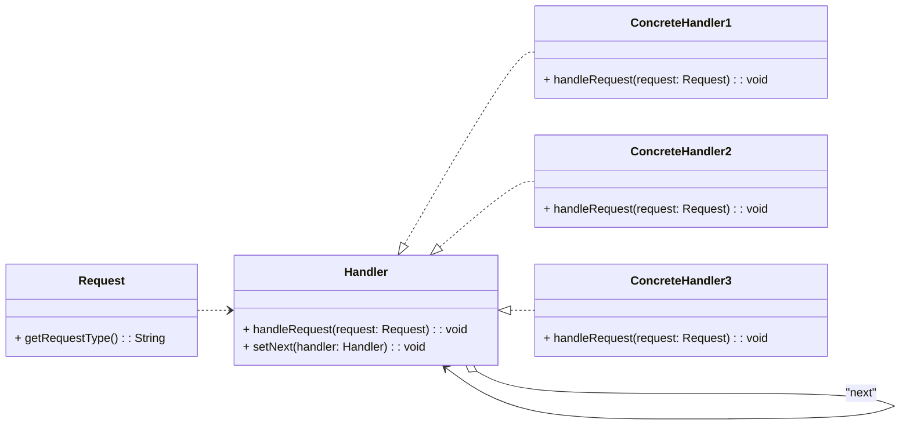

### Command Pattern

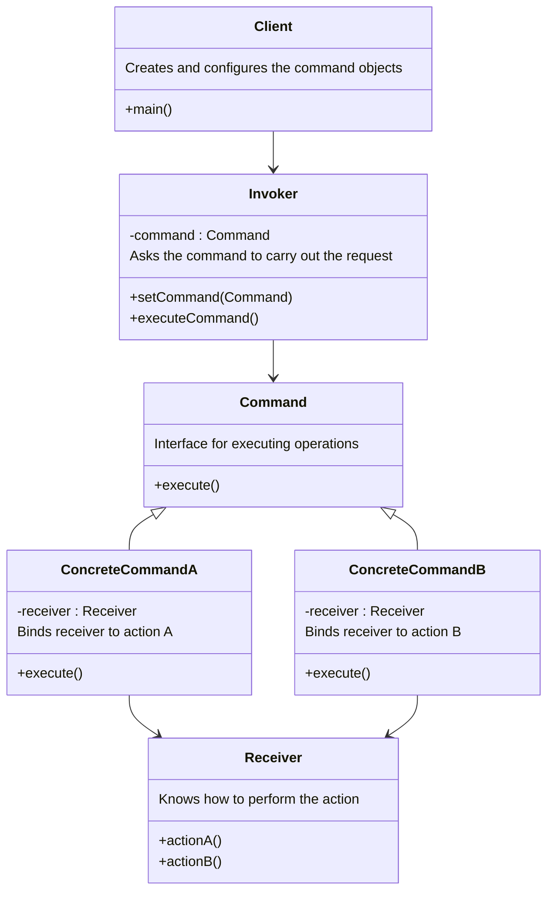

### Interpreter design pattern

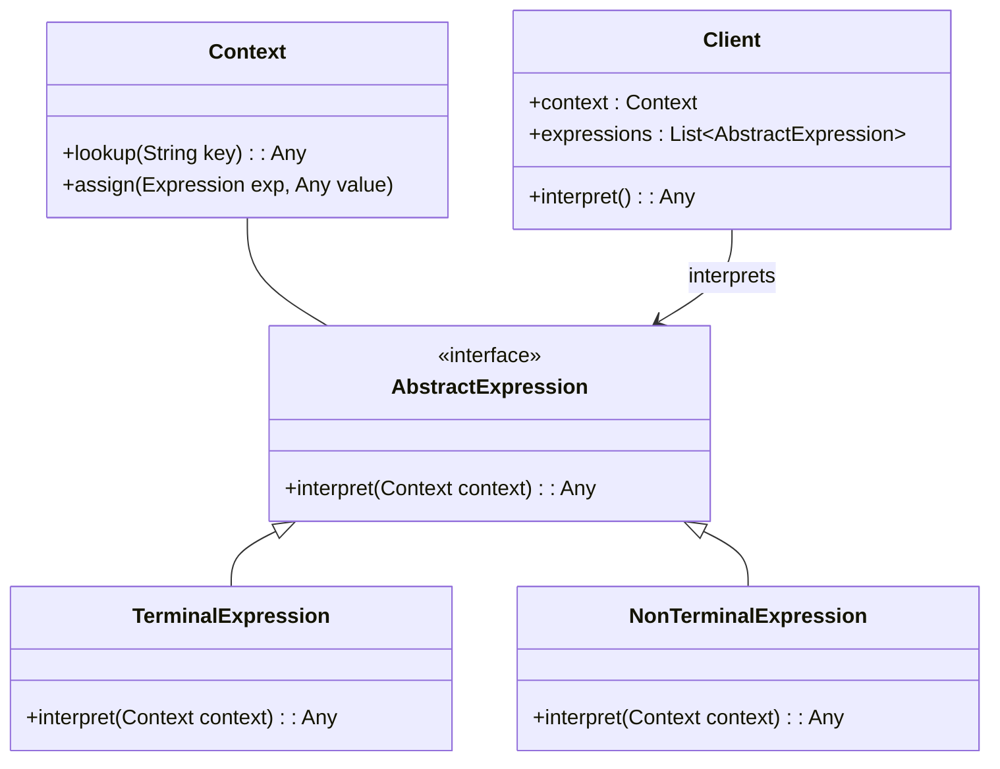

### Iterator pattern

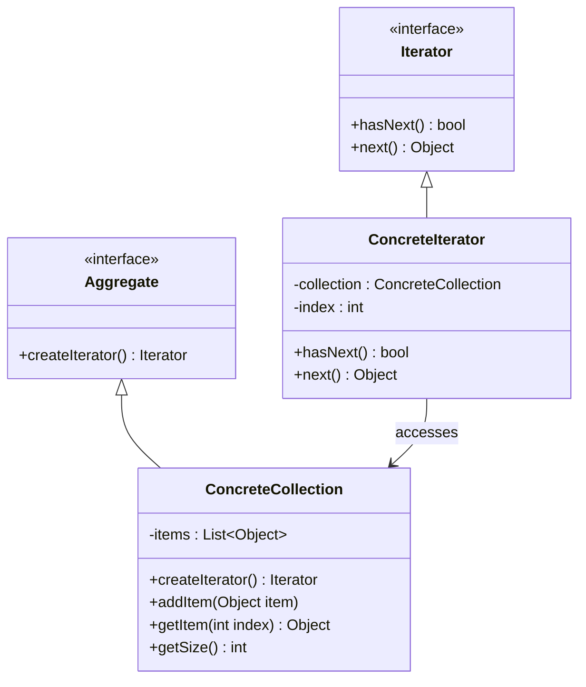

### Memento Pattern

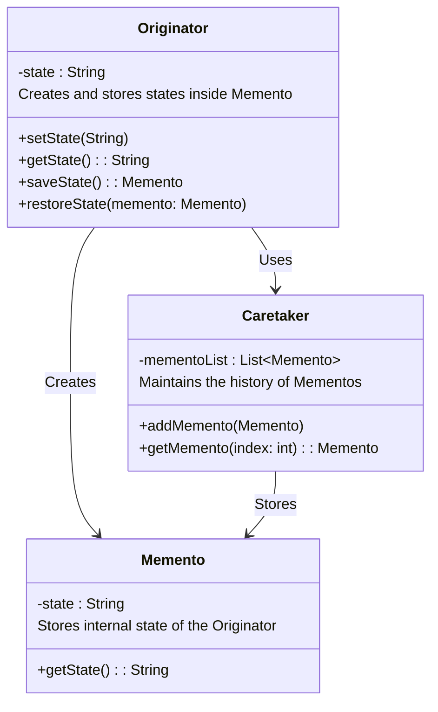

### Observer Pattern

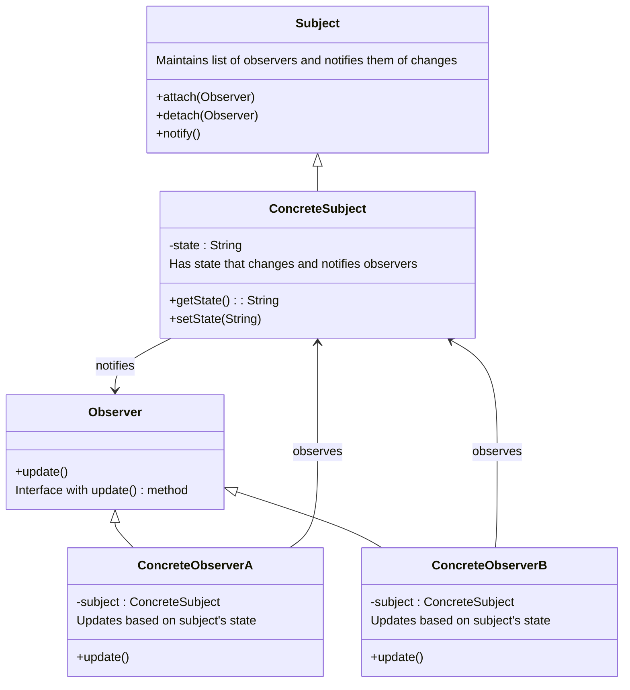

### State Pattern

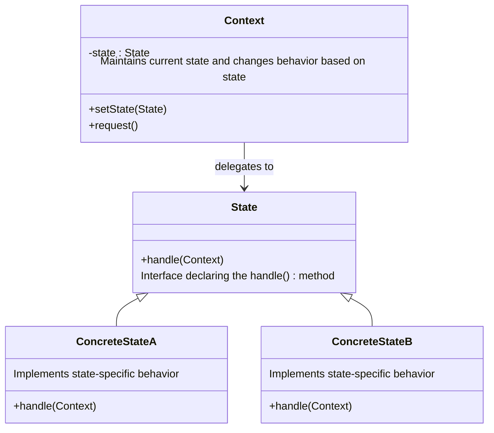

### Strategy Pattern

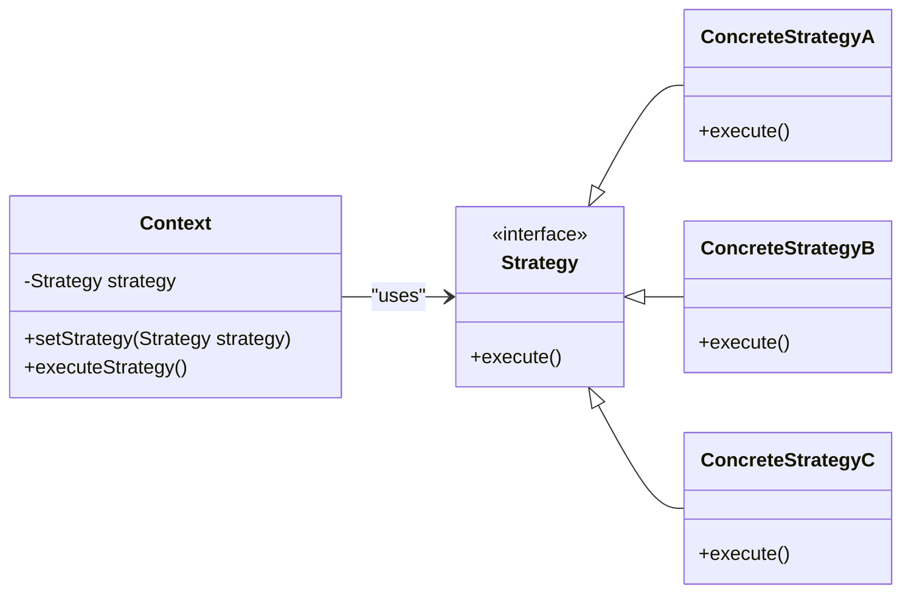